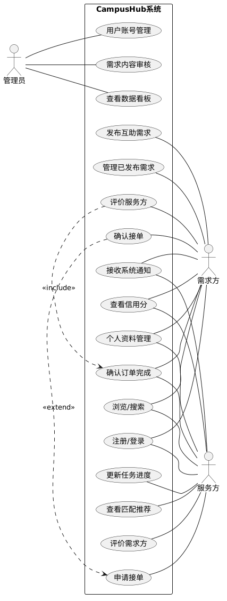

# 用例图 + 用例描述

---

## 用例图

---

## 用例描述

### 用例 1：发布互助需求（P0）

- 用例名称：发布互助需求
- 参与者：需求方
- 前置条件：用户已登录系统且账号状态正常。
- 基本流：
  1. 需求方点击“发布需求”按钮。
  2. 系统展示发布页面，要求输入标题、描述、分类（快递、学习等）、地点、过期时间和报酬。
  3. 需求方填写信息并提交。
  4. 系统验证信息完整性。
  5. 系统保存需求并将其状态设为“待接单”。
  6. 系统提示发布成功并跳转至详情页。
- 替代流：
  - 2a. 信息缺失：系统提示具体缺失项，保留已填内容，等待修正。
- 异常流：
  - E1. 内容触发违规关键词：系统调用安全审核模块检测到标题或描述包含违规信息（如违禁品交易）；系统拒绝发布并弹出警告提示，要求修改敏感词；同时记录该异常操作于后台审计日志。
  - E2. 支付/报酬校验失败：若选择“现金报酬”但金额设置超出系统单笔上限（如 500 元），系统提示“超出校园互助限额”，并阻止提交。
- 后置条件：需求在平台公开可见，供服务方浏览。

### 用例 2：订单流程管理 - 接单与完成（P0）

- 用例名称：接单与协作管理
- 参与者：服务方、需求方
- 前置条件：需求处于“待接单”状态。
- 基本流：
  1. 服务方在需求列表找到感兴趣的需求并点击“申请接单”。
  2. 需求方收到接单申请通知。
  3. 需求方在订单中心确认该服务方，订单状态变为“进行中”。
  4. 服务方完成互助任务后，在系统点击“申请结项”。
  5. 需求方核实后点击“确认完成”。
  6. 订单状态更新为“待评价”。
- 替代流：
  - 3a. 需求方拒绝申请：服务方收到通知，需求回到列表。
  - 5a. 需求方未按时确认：系统在 48 小时后自动提醒，或根据规则自动确认（视具体设计而定）。
- 异常流：
  - E1. 接单冲突（手慢无）：服务方 A 和 B 同时点击接单，系统锁定机制检测到订单状态已被 A 锁定；向 B 返回异常提示“该需求已被抢先领取”，并自动刷新列表。
  - E2. 恶意弃单（信用惩罚）：服务方接单后点击“取消订单”，系统提示“取消将扣除 10 信用分”；服务方确认后，系统自动扣分并通知需求方，同时重新释放需求到大厅。
  - E3. 交付争议（拒不确认）：服务方点击“申请结项”后，需求方认为任务未达成并拒绝确认；系统将订单转入“争议中”状态并提供“申诉”入口；提示双方提交证明材料，由管理员介入审核。
- 后置条件：订单进入信用评价阶段。

### 用例 3：评价与信用分计算（P1）

- 用例名称：双向评价与信用更新
- 参与者：需求方、服务方
- 前置条件：订单状态为“待评价”。
- 基本流：
  1. 需求方对服务方进行打分（1-5 星）并输入文字评价。
  2. 服务方对需求方进行打分及评价。
  3. 系统记录双方评价内容。
  4. 系统根据预设算法（如加权平均法）自动重新计算双方的信用分。
  5. 系统更新用户的信用等级标识。
- 替代流：
  - 1a. 某一方逾期未评价：系统默认 5 星好评（或执行默认策略），并在 7 天后关闭评价通道。
- 异常流：
  - E1. 数据库并发更新失败：由于多线程操作导致信用分计算并写入失败，系统执行事务回滚（Rollback），提示“服务繁忙，评分将在 5 分钟后同步”，并触发异步重试任务处理评分。
- 后置条件：更新后的信用分将直接影响“智能匹配与推荐”模块的权重。
