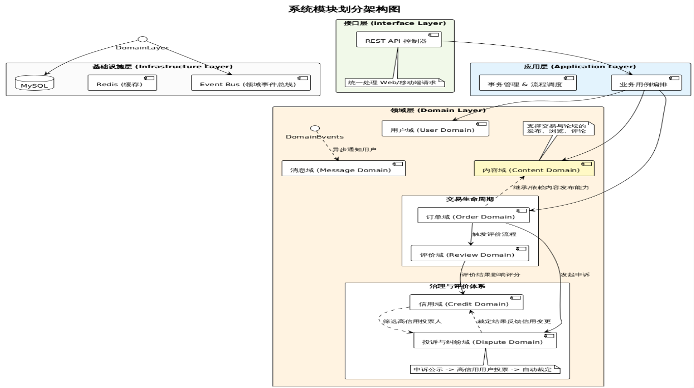

# 架构设计文档

---

## 架构概览

### 整体架构风格

本系统采用单体分层架构（Layered Monolithic Architecture）作为整体结构基础，
并在核心业务模块中引入领域驱动设计（DDD, Domain-Driven Design）与事件驱动（Event-Driven）机制

### 技术选型概览

核心技术栈：Spring Boot 3 + Vue 3 + MySQL

### 模块划分概述

#### 基于单体分层架构的基础分层

1. **接口层（API Layer）**：负责处理外部请求，提供 RESTful API 接口。
2. **应用层（Application Layer）**：负责业务用例的编排与流程控制。
3. **领域层（Domain Layer）**：核心业务逻辑，包含领域模型和领域服务。
4. **基础设施层（Infrastructure Layer）**：负责与外部资源交互，包括数据库、缓存及其他基础设施组件。

#### 领域层的模块划分

1. **内容域（Content Domain）**：提供系统的基础信息承载能力，是交易类与信息类互助的共同基础。
2. **订单域（Order Domain）**：交易类互助场景的核心，负责管理完整的交易流程。
3. **评价域（Rating Domain）**：用于记录用户之间的互评信息，是信用体系的重要数据来源。
4. **信用域（Credit Domain）**：基于用户行为与评价数据构建用户信用模型。
5. **投诉与纠纷域（Dispute Domain）**：处理用户之间的纠纷与投诉，提供必要的仲裁机制。
6. **消息域（Message Domain）**：负责系统内的消息通知与沟通功能。
7. **用户域（User Domain）**：管理用户信息、身份认证与权限控制。

#### 架构图



---

## 模块划分说明

### 基于单体分层架构的基础分层

本系统在整体结构上采用经典的单体分层架构（Layered Architecture），按照职责将系统划分为接口层、应用层、领域层与数据层（基础设施层），
各层之间遵循自上而下的依赖关系，实现关注点分离与结构清晰。

#### 接口层（Interface Layer）

- **职责**：

1. 接收和解析客户端请求，提供 RESTful API 接口。
2. 调用应用层服服务完成具体业务逻辑处理。
3. 统一封装响应结果，返回给客户端。

- **接口**：Controller(HTTP API)，不直接暴露领域模型，使用 DTO（Data Transfer Object）进行数据传输

- 注：接口层不包含业务逻辑，仅作为系统的输入输出边界

#### 应用层（Application Layer）

- **职责**：

1. 组织和协调多个领域对象完成业务流程。
2. 控制事务边界与执行顺序。
3. 调用领域层服务完成核心业务逻辑处理。
4. 在需要时发布领域事件，触发其他模块的处理。

- **接口**：Service，负责业务用例的编排与流程控制

- 注：应用层本身不承载复杂业务规则，而是负责“调度”和“编排”

#### 领域层（Domain Layer）

- **职责**：

1. 定义实体（Entity）与领域模型（Domain Model）
2. 实现核心业务规则与状态转换
3. 提供领域服务（Domain Service）封装复杂业务逻辑
4. 定义领域事件（Domain Event）用于事件驱动机制

- **接口**：Repository（持久化接口），事件机制 （发布领域事件，供其他模块监听处理），数据查询可直接跨领域调用（如订单查询评价信息）但不反向依赖

- 注：领域层强调高内聚与业务语义表达，是系统复杂度的主要承载位置

#### 基础设施层（Infrastructure Layer）

- **职责**：

1. 实现领域层定义的持久化接口（Repository）
2. 进行数据持久化与查询操作
3. 提供与外部系统的集成支持（如消息队列、缓存等）

- 注：该层不包含业务逻辑，仅提供技术能力支持

### 领域层的模块划分

在领域层内部，系统按照业务功能进一步划分为多个子领域（Subdomain），以实现业务逻辑的模块化与高内聚设计。

#### 内容域（Content Domain）

- **职责**：

1. 支持系统的基础信息承载能力，为交易类与信息类互助提供共同基础。
2. 提供内容的发布、编辑，提供内容浏览与检索功能，管理评论等基础交互功能。

#### 订单域（Order Domain）

- **职责**：

1. 管理订单的生命周期，包括订单创建、支付、完成与取消等状态转换。
2. 在关键状态发生变化时产生领域事件，触发其他模块的处理（如信用更新、消息通知等）。

#### 评价域（Review Domain）

- **职责**：

1. 支持订单完成后的用户双向评价功能，记录用户之间的互评信息。
2. 管理评分和评价内容，为信用体系提供重要数据来源。

#### 信用域（Credit Domain）

- **职责**：

1. 计算与维护用户信用分，根据用户行为与评价数据构建用户信用模型。
2. 根据评价、违规行为等动态调整用户信用分，提供信用查询接口供其他模块使用。

#### 投诉与纠纷域（Dispute Domain）

- **职责**：

1. 提供投诉入口与信息管理
2. 支持纠纷处理流程与结果记录
3. 辅助仲裁决策，提供必要的数据支持

#### 消息域（Message Domain）

- **职责**：

1. 提供系统内的消息通知与沟通功能
2. 通过监听领域事件实现跨模块的消息通知（如订单状态变化、评价完成等）

#### 用户域（User Domain）

- **职责**：

1. 用户注册、登录与身份管理
2. 用户资料维护
3. 用户状态控制

### 模块依赖关系

#### 总体依赖原则

依赖方向必须始终从外向内：Interface → Application → Domain → Infrastructure
系统严格遵循分层依赖原则，各层仅依赖其下层能力，避免跨层调用与反向依赖

#### 领域层内部依赖关系

| 模块      | 依赖            |
|---------|---------------|
| Content | User          |
| Order   | User, Content |
| Review  | Order         |
| Credit  | Review（或事件）   |
| Dispute | Order         |
| Message | 无（只监听事件）      |

---

## 技术选型说明

### 前端框架：Vue 3

- **选择理由**：

1. Vue 3 是当前主流的前端框架，具有成熟的生态
2. 组件化开发模式提高开发效率，适合构建复杂的用户界面。
3. 学习成本较低，社区资源丰富，便于团队成员快速上手。
4. 与后端 RESTful API 的集成较为方便，支持现代前端

### 后端框架：Spring Boot 3

- **选择理由**：

1. Spring Boot 3 是当前主流的 Java 后端框架，具有成熟的生态系统和丰富的社区支持。
2. 提供完整的Web开发能力，支持快速构建RESTful API。
3. 自动化配置降低开发复杂度，适合快速迭代开发。
4. 与Spring生态系统（如Spring Data JPA、Spring Security等）无缝集成，满足系统的多样化需求。
5. 便于实现分层架构与DDD设计

### 数据库：MySQL

- **选择理由**：

1. 关系型数据库，适合存储结构化数据，满足系统的核心数据存储需求。
2. 支持事务，适合订单等核心业务数据的一致性要求。

### 持久化框架：Spring Data JPA

- **选择理由**：

1. 与Spring Boot无缝集成，简化数据访问层的开发。
2. 适合快速开发与DDD模型映射

### 缓存组件：Redis

- **选择理由**：

1. 高性能的内存数据存储，适合缓存热点数据，提高系统响应速度。
2. 支持多种数据结构，适合实现复杂的缓存策略。

### 事件机制：Spring Event

- **选择理由**：

1. Spring框架内置的事件机制，便于实现领域事件的发布与监听。
2. 适合实现模块间的解耦，支持事件驱动的服务。

---

## 模块划分目录结构示例

```
backend/
└── src/main/java/com/campushub/campusbackend/
    ├── CampusHubApplication.java

    ├── interfaces/                         # 接口层（Controller）
    │   ├── user/
    │   │   └── UserController.java
    │   ├── content/
    │   │   └── ContentController.java
    │   ├── order/
    │   │   └── OrderController.java
    │   ├── review/
    │   │   └── ReviewController.java
    │   ├── dispute/
    │   │   └── DisputeController.java
    │   ├── message/
    │   │   └── MessageController.java
    │   └── admin/
    │       └── AdminController.java

    ├── application/                        # 应用层（业务编排）
    │   ├── user/
    │   │   ├── UserAppService.java
    │   │   ├── impl/
    │   │   │   └── UserAppServiceImpl.java
    │   │   └── dto/
    │   │       ├── UserDTO.java
    │   │       └── request/
    │   │           └── RegisterRequest.java
    │   │
    │   ├── content/
    │   │   ├── ContentAppService.java
    │   │   ├── impl/
    │   │   │   └── ContentAppServiceImpl.java
    │   │   └── dto/
    │   │       ├── ContentDTO.java
    │   │       └── request/
    │   │           └── PublishContentRequest.java
    │   │
    │   ├── order/
    │   │   ├── OrderAppService.java
    │   │   ├── impl/
    │   │   │   └── OrderAppServiceImpl.java
    │   │   └── dto/
    │   │       ├── OrderDTO.java
    │   │       └── request/
    │   │           ├── CreateOrderRequest.java
    │   │           └── CompleteOrderRequest.java
    │   │
    │   ├── review/
    │   │   ├── ReviewAppService.java
    │   │   └── impl/
    │   │       └── ReviewAppServiceImpl.java
    │   │
    │   ├── dispute/
    │   │   ├── DisputeAppService.java
    │   │   └── impl/
    │   │       └── DisputeAppServiceImpl.java
    │   │
    │   ├── message/
    │   │   ├── MessageAppService.java
    │   │   └── impl/
    │   │       └── MessageAppServiceImpl.java
    │   │
    │   └── admin/
    │       ├── AdminAppService.java
    │       └── impl/
    │           └── AdminAppServiceImpl.java

    ├── domain/                             # 领域层（核心业务）
    │
    │   ├── user/
    │   │   ├── entity/
    │   │   │   └── User.java
    │   │   ├── repository/
    │   │   │   └── UserRepository.java
    │   │   └── service/
    │   │       └── UserDomainService.java
    │
    │   ├── content/                        # 内容域（共享基础能力）
    │   │   ├── entity/
    │   │   │   ├── Post.java
    │   │   │   └── Comment.java
    │   │   ├── repository/
    │   │   │   ├── PostRepository.java
    │   │   │   └── CommentRepository.java
    │   │   └── service/
    │   │       └── ContentDomainService.java
    │
    │   ├── order/                          # 核心交易域
    │   │   ├── entity/
    │   │   │   ├── Order.java
    │   │   │   └── OrderStatus.java
    │   │   ├── repository/
    │   │   │   └── OrderRepository.java
    │   │   ├── service/
    │   │   │   └── OrderDomainService.java
    │   │   └── event/
    │   │       ├── OrderCreatedEvent.java
    │   │       ├── OrderCompletedEvent.java
    │   │       └── OrderCancelledEvent.java
    │
    │   ├── review/
    │   │   ├── entity/
    │   │   │   └── Review.java
    │   │   ├── repository/
    │   │   │   └── ReviewRepository.java
    │   │   └── service/
    │   │       └── ReviewDomainService.java
    │
    │   ├── credit/
    │   │   ├── entity/
    │   │   │   └── Credit.java
    │   │   ├── repository/
    │   │   │   └── CreditRepository.java
    │   │   └── service/
    │   │       └── CreditDomainService.java
    │
    │   ├── dispute/
    │   │   ├── entity/
    │   │   │   └── Dispute.java
    │   │   ├── repository/
    │   │   │   └── DisputeRepository.java
    │   │   └── service/
    │   │       └── DisputeDomainService.java
    │
    │   └── message/
    │       ├── entity/
    │       │   └── Message.java
    │       └── service/
    │           └── MessageDomainService.java
    │
    │   

    ├── infrastructure/                     # 基础设施层
    │
    │   ├── persistence/                   # JPA实现
    │   │   ├── user/
    │   │   │   └── UserRepositoryImpl.java
    │   │   ├── content/
    │   │   │   ├── PostRepositoryImpl.java
    │   │   │   └── CommentRepositoryImpl.java
    │   │   ├── order/
    │   │   │   └── OrderRepositoryImpl.java
    │   │   ├── review/
    │   │   │   └── ReviewRepositoryImpl.java
    │   │   ├── credit/
    │   │   │   └── CreditRepositoryImpl.java
    │   │   └── dispute/
    │   │       └── DisputeRepositoryImpl.java
    │
    │   ├── jpa/                            # Spring Data JPA接口
    │   │   ├── user/
    │   │   │   └── JpaUserRepository.java
    │   │   ├── content/
    │   │   │   ├── JpaPostRepository.java
    │   │   │   └── JpaCommentRepository.java
    │   │   ├── order/
    │   │   │   └── JpaOrderRepository.java
    │   │   ├── review/
    │   │   │   └── JpaReviewRepository.java
    │   │   ├── credit/
    │   │   │   └── JpaCreditRepository.java
    │   │   └── dispute/
    │   │       └── JpaDisputeRepository.java
    │
    │   ├── event/                          # 事件机制
    │   │   ├── DomainEventPublisher.java
    │   │   └── listener/
    │   │       ├── CreditEventHandler.java
    │   │       ├── MessageEventHandler.java
    │   │       └── ReviewEventHandler.java
    │
    │   ├── config/                         # 技术配置
    │   │   ├── JpaConfig.java
    │   │   ├── RedisConfig.java
    │   │   └── SwaggerConfig.java
    │
    │   └── security/                       # 认证相关（JWT）
    │       ├── JwtTokenProvider.java
    │       └── SecurityConfig.java

    ├── common/                             # 通用模块
    │   ├── exception/
    │   │   ├── BusinessException.java
    │   │   └── GlobalExceptionHandler.java
    │   ├── response/
    │   │   └── ApiResponse.java
    │   ├── util/
    │   │   └── IdGenerator.java
    │   └── constant/
    │       └── SystemConstants.java

    └── config/                             # 全局配置
        ├── WebConfig.java
            └── CorsConfig.java
        ```
